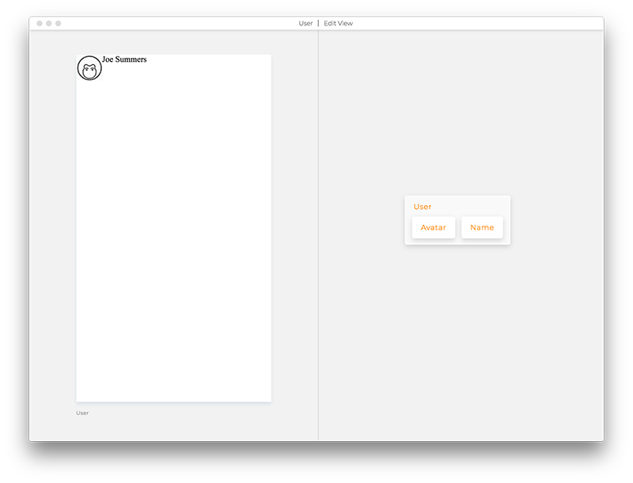
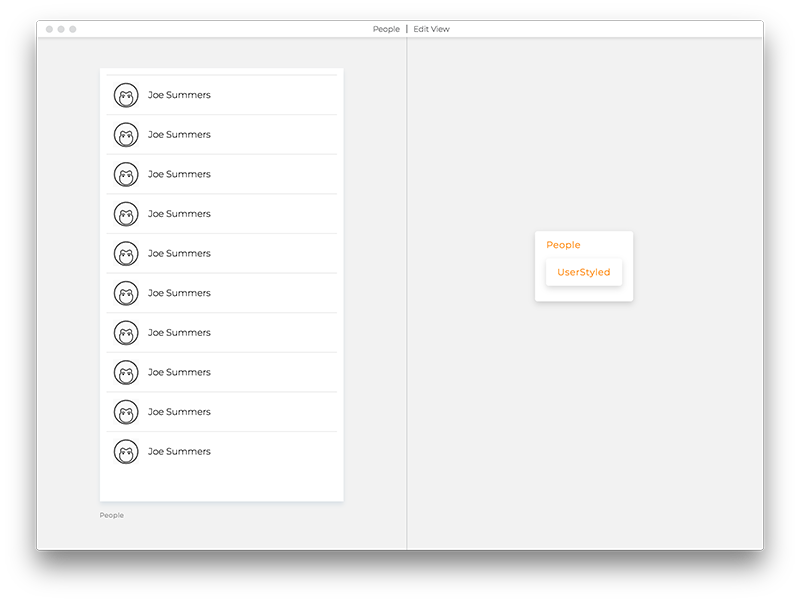

# Examples of basic blocks - Content blocks

## Basic Text block

```views
Text
text Buy Now!
```

## Named Text block

```views
Label Text
text Buy Now!
```

## Text block with interpolated dynamic prop

To embed dynamic values inside a text value, use a simple slot and pass the dynamic
value from the `.view.logic.js`, like:

```views
Text
text <greeting
```

Then in the `.view.logic.js` file use:

`greeting={`Welcome ${props.username}`}`

This will render in the view as `Welcome Joe`.

Another way of doing it would be to split the Text into two Text blocks:

```views
Horizontal
Text
text Welcome

Text
text <username
```

## Image

`Image` takes a `source` property, it can be a URL or a local file.

```views
UserAvatar Image
source https://viewsdx.s3.amazonaws.com/userAvatar.png
```

## Captures

`Capture` is your way to accept written input from a user. We have a few types
defined for this:

* `CaptureEmail`
* `CaptureFile`
* `CaptureInput`
* `CaptureNumber`
* `CapturePhone`
* `CaptureSecure`
* `CaptureText`
* `CaptureTextArea`

To set content of a any capture field use `placeholder` property. Example:

```
Email CaptureEmail
placeholder john@email.com
```

To auto focus in a Capture field use `autoFocus` property. Example:

```
CaptureTextArea
autoFocus true
```

The docs for [React forms](https://reactjs.org/docs/forms.html) apply for React
DOM. For native we're [doing a bit more for you](https://github.com/viewstools/morph/blob/master/__tests__/__snapshots__/react.js.snap#L1682-L1697).
This is still work in progress and we're loooking at integrating some of the
concepts of [formik](https://github.com/jaredpalmer/formik) to easy form
creation and management without dictating UI.

## Svgs

_SVGs are amazing_. They let you do amazing graphics that scale like crazy.
Of course you can use an `Image` block to just show an SVG file as an image
but if you want to do more crazy stuff with them, like animating parts of it
or changing how it looks like on the fly, you're better off using an `Svg`
block. Inside it, you can use a these specific blocks:

* `SvgCircle`
* `SvgEllipse`
* `SvgGroup`
* `SvgLinearGradient`
* `SvgRadialGradient`
* `SvgLine`
* `SvgPath`
* `SvgPolygon`
* `SvgPolyline`
* `SvgRect`
* `SvgSymbol`
* `SvgText`
* `SvgUse`
* `SvgDefs`
* `SvgStop`

While you can make an `Svg` by hand, like:

```views
Svg
viewBox 0 0 20 20
width 20
height 20
SvgCircle
cx 10
cy 10
r 5
stroke deepskyblue
```

It's certainly more fun that have that done automatically for you 😇. You can
run `npx views-morph file.svg` in your Views project folder and 💥! You'll get a ready to go Views Svg!

[Here's a little video on how you can use it in your project today](https://medium.com/viewsdx/from-svg-to-view-in-1-2-3-79cf8d771485).

# Containers

_Container_ blocks let you group blocks together. They are:

* `Vertical`
* `Horizontal`
* `List`

## Button

Button with an icon on the side:

```views
Button Horizontal
onClick props
Icon Svg
width 15
height 15
viewBox 0 0 25 25
SvgPath
d M24.5 9.7c-.2-.4-.5-.6-.9-.7l-7.1-1-3.2-6.4c-.3-.7-1.5-.7-1.8 0L8.4 8l-7 1c-.4.1-.7.3-.9.7s0 .8.3 1l5.1 5-1.2 7.1c-.1.4.1.8.4 1 .2.1.4.2.6.2.2 0 .3 0 .5-.1l6.3-3.3 6.3 3.3c.3.2.7.1 1.1-.1.3-.2.5-.6.4-1l-1.2-7.1 5.1-5c.3-.3.4-.6.3-1z


Label Text
text Buy Now!
```

Button with an icon on the top:

```views
Button Vertical
onClick props
Icon Svg
width 15
height 15
viewBox 0 0 25 25
SvgPath
d M24.5 9.7c-.2-.4-.5-.6-.9-.7l-7.1-1-3.2-6.4c-.3-.7-1.5-.7-1.8 0L8.4 8l-7 1c-.4.1-.7.3-.9.7s0 .8.3 1l5.1 5-1.2 7.1c-.1.4.1.8.4 1 .2.1.4.2.6.2.2 0 .3 0 .5-.1l6.3-3.3 6.3 3.3c.3.2.7.1 1.1-.1.3-.2.5-.6.4-1l-1.2-7.1 5.1-5c.3-.3.4-.6.3-1z


Label Text
text Buy Now!
```

## List of cards


List of cards:

```views
People List
from <
User
```

List repeats one view. The item has to be saved as a `.view` file within your project
and it CANNOT be a basic block, like Text or Image.

In this example `User.view` file looks like this:



```views
User Horizontal
Avatar Image
source <userAvatar https://viewsdx.s3.amazonaws.com/userAvatar.png

Name Text
text <userName Joe Summers
```



Styled user card in a list would look more like this:

```views
User Horizontal
alignItems center
paddingTop 10
paddingLeft 10
paddingRight 10
marginTop 10
marginLeft 10
marginRight 10
borderTop 1px solid #e6e6e6
Avatar Image
source <userAvatar https://viewsdx.s3.amazonaws.com/userAvatar.png
width 40
height 40

Name Text
text <userName Joe Summers
fontSize 14
fontFamily Montserrat
fontWeight 300
marginLeft 15
```

Reach out with questions via our [Slack Questions Channel](https://slack.viewsdx.com/).
Mention `@views-tom` or `@dario` to make sure that we get your notifications.
