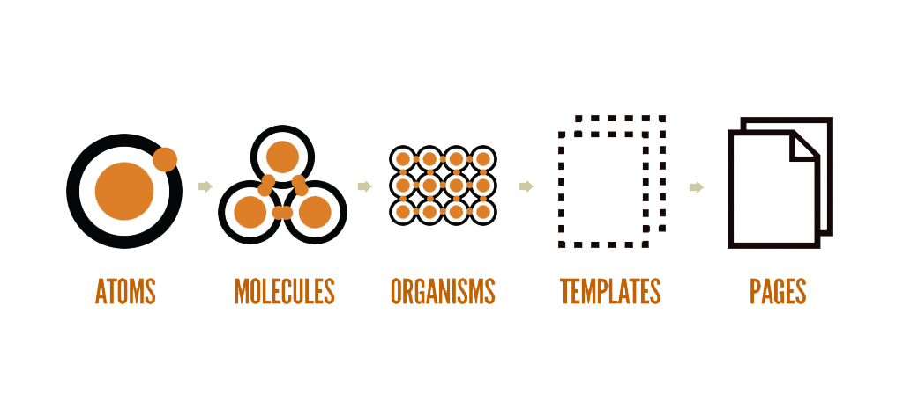
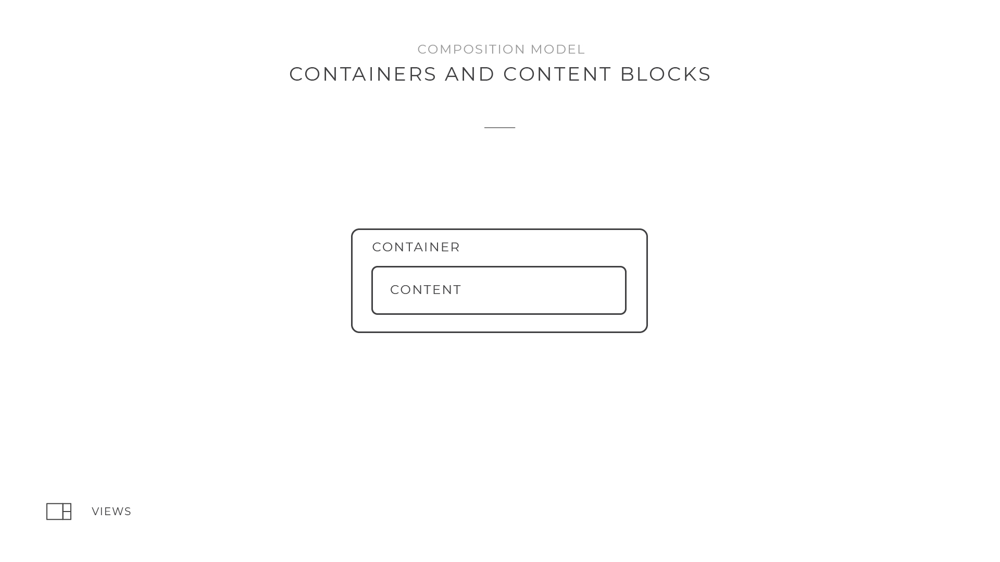
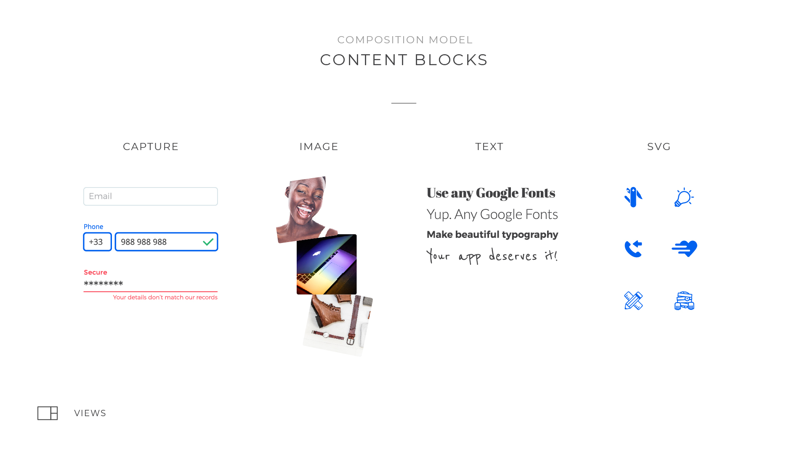

# Views Composition Model

## Atomic Design

Views uses [Atomic Design Composition Pattern](http://patternlab.io/) to ensure
interface consistency across all views.



Views composition model is a collection of embeddable blocks.


Every `.view` file is a self contained component with a top level container block and content blocks.
As a component it can be used inside of any other `.view` file and styled at point of use.


The power of the atomized composition model allows components to become reusable templates as the
app's functionality and the design system grows.

We use [Yoga layout engine](https://github.com/facebook/yoga)

## Containers and content blocks

Containers wrap other blocks, displace, and align them.


### Containers

1. Horizontal distributes blocks inside next to each other.
2. Vertical distributes blocks inside on top of each other.
3. List repeats one block based on the amount of passed data.


Examples of final interface


[More on containers](../Blocks/README.md)

### Content blocks

1. Capture block lets you capture user input as data.
2. Image block displays graphic files, like JPGs, PNGs, GIFFs, and more
3. Text block renders text in the view.
4. SVG block renders vector graphics.


[Examples of basic blocks](../Blocks/README.md)


## Proximity nesting and Composer

Proximity nesting (when you use code editor) is how we do composition inside a view.
You can think about your view as a stack of blocks where new lines set blocks apart.

Composer is a composition tool, and comes with Views Tools.

**In Composer**


**In Code**
```views
FirstNestingLevel Vertical
SecondNestingLevel Vertical
Text
```

In the example above, the hierarchy is:
* `FirstNestingLevel`
  * `SecondNestingLevel`
    * `Text`

**In Composer**


**In Code**

What if we want to have the text at the same level of `InsideTop`? Our code
would look like:

```views
FirstNestingLevel Vertical
SecondNestingLevel Vertical

Text
```

Our hierarchy now looks like:
* `FirstNestingLevel`
  * `SecondNestingLevel`
  * `Text`
That new line before `Text` separates it from `InsideTop`.

Each new line will move blocks below one nesting level higher, and since a view
can only have one top level block, you can remove blocks from the view by adding
enough empty space before.

```
Top Vertical
Text


Text
```
In the example above, the second `Text` is outside of the top level container
therefore it won't render in the view.

## Save and re-use .view files
Views can be used as part of other views by referencing their file name.

Common use case: Say you have a View that contains a button with a text label and
you want to choose different label, or the fontSize depending where you use it.

Here're simple steps to extract blocks and re-use them:
1. Save the button code to separate .view file and give it a name
starting with a capital letter
2. Replace the previous button code with only the name of the extracted View,
in our example it's `Filename`
3. From now on `Filename.view` is your Custom block and you will
see it being updated across your app upon any new changes.

### Use case one - change text at the point of use

This is a simple View with one Text block BEFORE using it as a Custom Block:


**before**
```views
Button Vertical
backgroundColor #009fff
borderRadius 8
Text
padding 20
color white
fontFamily Montserrat
fontSize 16
fontWeight 700
text BUY NOW!
```

Take all the lines of the `Text` block and paste them to a new document. Save it
within your project as `Label.view`. If you want to reuse the `Label` in many places with
different text, turn it into slot by adding `< ` before the value.

```views
Label Text
padding 20
color white
fontFamily Montserrat
fontSize 16
fontWeight 700
text < default label
```

And here's how it should look like AFTER saving `Text` as `Label.view` file
and using it in the `Button.view` file:


**after**
```views
Button Vertical
backgroundColor #009fff
borderRadius 8
Label
text BUY NOW!
```

### Use case two - change the size of the font in one place

Back to our example. To change the font size in all instances of `Button.view`
change the `fontSize` value directly in the `Label`:


**before**
```views
Button Vertical
backgroundColor #009fff
borderRadius 8
Label
text BUY NOW!
```

```views
Label Text
padding 20
color white
fontFamily Montserrat
fontSize 14
fontWeight 700
text < default label
```

And here's how it should look like AFTER saving `Text` as `Label.view` file
and using it in the `Button.view` file:


**after**
```views
Button Vertical
backgroundColor #009fff
borderRadius 8
Label
text BUY NOW!
```
Notice that we've changed the `fontSize` value in the `Label.view` and the `Button.view`
is affected but doesn't "know" anything about that change, since it happened in self-contained
`Label` file.

```views
Label Text
padding 20
color white
fontFamily Montserrat
fontSize 20
fontWeight 700
text < default label
```


Reach out with questions via our [Slack Questions Channel](https://slack.viewsdx.com/).
Mention `@views-tom` or `@dario` to make sure that we get your notifications.
