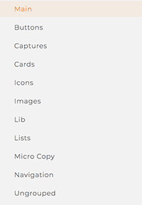

# Useful Conventions
Based on extensive testing we've created these rules to help you optimize the workflow.

## Always name blocks
This is better
```views
Button Vetrical
onClick props.buy
Label Text
text Buy Now!
```
Than this
```views
Vetrical
onClick props.buy
Text
text Buy Now!
```

## Extract blocks as view files to keep the composition simple
This is better
```views
Button
onClick props.buy
```
Than this
```views
Button Vetrical
onClick props.buy
Label Text
text Buy Now!
```
Where `Button` is a `Button.view` file
```views
Button Vetrical
onClick props
Label Text
text Buy Now!
```

## Don’t name props unless you absolutely have to
This is better
```views
Label Text
text props
```
Than this
```views
Label Text
text props.label
```
If you avoid naming props, you can use the properties by the same name at the point of use
```views
Label
text Buy Now!
```
Otherwise, you would have to remember what is the custom name of the prop
```views
Label
label Buy Now!
```

## Keep props simple
This is better
```views
Label Text
onWhen props.isVisible
text Buy Now!
```
Than this
```views
Label Text
onWhen props.isOne && props.isTwo || props.isThree
text Buy Now!
```
Manage these in the logic file and expose simple prop back to the view like the
one above `props.isVisible`

Complex props are easier for designers to reason about and they can be editable
in the Views Tools.

## Don't repeat blocks, use lists
This is better
```views
Books List
from props
Book
```
Than this
```views
Book

Book

Book

Book
```
In design tools, we tend to duplicate elements in the layout to represent the lists.
In production, we use lists with data passed dynamically from props.

## Design System folders
Any folders you create inside of the `src` in your project will be recognized by
Views Tools and displayed on the side nav.

Here's the example structure that usually works for modern applications, but you
can organize your project the way fits your needs:
```
Buttons
Captures
Cards
Custom
Icons
Images
Lists
Main
MicroCopy
Navigation
```

Any .view files saved in the main `src` folder will be shown in `Ungrouped` folder
in Views Tools.

If you use `Main` folder to keep the top level views of your application, it will be
a default folder in Views Tools, making it easy to explore the layouts to designers.

## Sensible duplication and use of props
When you face a question:
"Should I duplicate a view or keep adding props to it?"
You can think of the answer this way:
1. Each view should be unique
2. There is no value in having only props in a .view file, like this:
```views
Label Text
text props
color props
fontSize props
fontFamily props
marginTop props
marginBottom props
```
That view is totally useless since all the properties would have to be repeated
at the point of use:
```views
Label
text Buy Now!
color green
fontSize 14
fontFamily Open Sans
marginTop 10
marginBottom 10
```
Back to duplication question.
Say, you have a Label view defined by these properties:
```views
Label Text
text props
color green
fontSize 14
fontFamily Open Sans
```
But you also want to use another Label with different color. If the color of the Labels
will be what differentiate them in your design then duplicate the Label, and change its name
to `LabelGreen.view`. The duplicated Label can be now called `LabelRed.view`:
```views
Label Text
text props
color red
fontSize 14
fontFamily Open Sans
```

## For readability, put the onWhen property as a first line below the block's name
This reads better in Views Tools and in code
```views
Label Text
onWhen props.isVisible
fontSize 14
color green
```
Than this
```views
Label Text
fontSize 14
color green
onWhen props.isVisible
```

Reach out with questions via our [Slack Questions Channel](https://slack.viewsdx.com/).
Mention `@views-tom` or `@dario` to make sure that we get your notifications.
