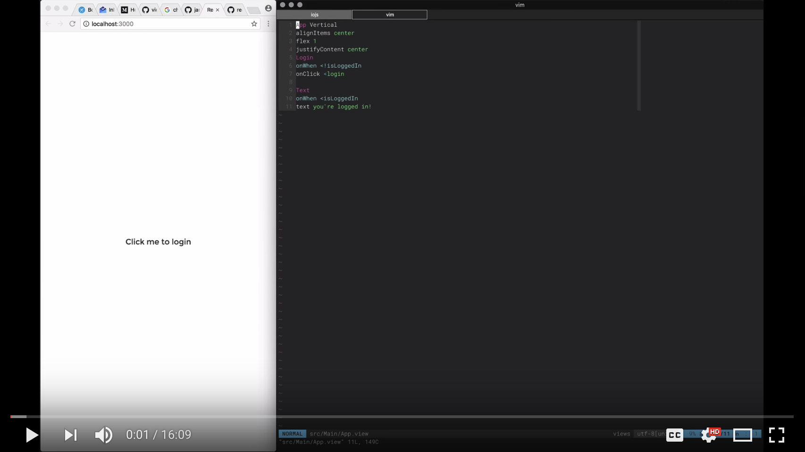

# .view.logic.js

Any View file can be also wrapped with JavaScript logic to make a Smart View.

With `Counter.view` file like:

```
Text
color black
text props.number
```

We can add a `Counter.view.logic.js` file that would increment a number by one
every second like this:

```
import Counter from './Counter.view.js'
import React from 'react'

export default class CounterLogic extends React.Component {
  state = {
    number: 0,
  }

  componentDidMount() {
    this._interval = setInterval(this.increment, 1000)
  }

  componentWillUnmount() {
    clearInterval(this._interval)
  }

  increment = () => {
    this.setState({
      number: this.state.number + 1
    })
  }

  render() {
    return <Counter number={this.state.number} />
  }
}
```

A logic file is an extension to your view and Views imports that it if it's
available. In other words, if you then use your `Counter` in other views, you
will actually be using the `Counter.view.logic.js` instead.

This is where you would add any intermediate state to your views or connect them
to an external store of data.

Reach out with questions via our [Slack Questions Channel](https://slack.viewsdx.com/).
Mention `@views-tom` or `@dario` to make sure that we get your notifications.

## Control global state

Here's the video to the session that shows how to manage global state:

[](https://youtu.be/kUT0crvNhoA)

Here's the link to the [repo shown in the video](https://github.com/viewstools/dealing-with-global-app-state).


