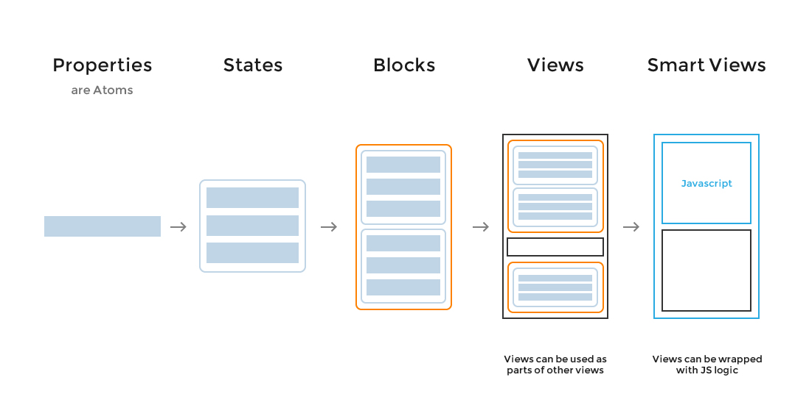
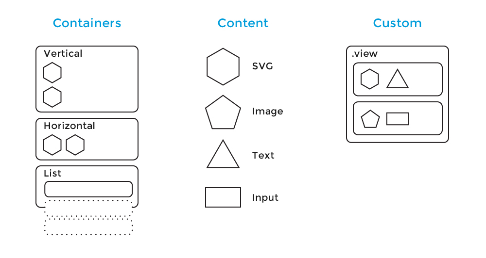
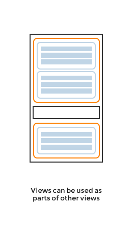

# Views Docs - Productive framework for creating production quality interfaces

## 👋 How can you benefit from what we are doing?
Views language is simple. There is no divs, classes, ids. We use blocks to compose interfaces.
Blocks make the composition easy to undersand even for non-technical professionals.

Views makes teams productive. Designers contribute directly to production build.
Views improves build quality. Designers can tweak styling without wasting dev time.
Views compiles to React and React Native. No manual work is required in the compilation process.
Views comes with a creative toolset. For designers who don't like to code.

You can speed up your development.
Perform faster revision loops.
Test innovative ideas.

## 🚀 Is someone else using it successfully?
Yes! We currently have a strategic partner using Views to deliver their core
application to their 50 million users in the USA. 

Interface of our toolset is fully build in Views (using [React DOM app](https://github.com/facebookincubator/create-react-app) wrapped in [Electron](https://electron.atom.io/)).

## Using Views in your project
For now, Views morphs to the web and desktop through React DOM and to iOS and
Android through React Native. 

You can start new React project with Create-React-App and [Use Views](https://github.com/viewsdx/use) commands.

### with create-react-app
```
yarn install --global create-react-app use-views
create-react-app my-app
cd my-app
use-views
yarn start
```

### with create-react-native-app
```
yarn install --global create-react-native-app use-views
create-react-native-app my-native-app
cd my-native-app
use-views
```

### with an existing project
```
yarn add views-morph
views-morph . --watch --as react-dom
```

You will want to add this to your `.gitignore` file:
```
# views
**/*.data.js
**/*.view.js
**/*.view.css
**/*.view.tests.js
```
### in a sample project

[Here's a video with the most recent overview of sample project installation and use](https://learn.viewsdx.com/june-2017-overview-update-5843a2142308).

# Composition model

Views uses [Atomic Design Composition Pattern](http://patternlab.io/) to ensure
interface consistency across all views.


Views composition model is a collection of nested blocks


Looking at View syntax architecture we recognise these elements:
1. Properties - the lowest level element, ie. `backgroundColor`
2. States - groups of properties related to functionality of a Block, enabled by `when`
3. Blocks - groups of States
4. Views - groups of Blocks saved in a .view file
5. Smart Views/ Logic - Views grouped with Javascript logic, super powerful stuff. ⚡️ 🔥 💥 ☄️ 




## Properties
Props are all that matters in Views!

Properties define the style and type of all States, Blocks and Views.

There are two kinds of properties:
- Internal - value is defined in the same .view file - Example: `text Buy Now`, `color red`
- External - value comes from somewhere else (.view.tests file, service,
  back-end) - Example: `text props.buttonLabel`

Say, you want to change the Button's Label dynamically depending on the View
where the button is being used in?
1. Replace value you want to turn into dynamic with `props.anyName`
2. Pass the value in Tests or at the point of use with `anyName Value`

BEFORE replacing the Label value with dynamic value:
```views
Text
text Button Label
fontSize 20
color #f7941e
```

AFTER replacing making the value dynamic:
```views
Text
text props.buttonLabel
fontSize 20
color #f7941e
```

At that point you have two choices for setting the value, and it depends on if it the value
for the label is set by you or by the user of your app:
- Let buttonLabel to remain an external prop and provide it in .view.tests to see
rendered result during your design process
- Set value of buttonLabel at the point of use, directly below UI Variable name.

Here's how you set it up on the point of use:
```views
Filename
buttonLabel Buy Now!
```

TODO explain toggles `onClick toggle props.stuff`
TODO Introduce Alfa Release of Animations

## States

Blocks and Views can have many states driven by `when` statments.
Example:
```
Text
when props.error
text This is wrong...

Text
when !props.error
text This is ok :)
```

TODO Implement Improved States, more deatils in the [roadmap](https://trello.com/b/NhIKKbol/views-roadmap)

## Blocks

A `Hello World` example in Views may look like:
```views
Text
text Hello World
```

A block is defined by its type. In the example above we use `Text` type of block
to render text in the view.

Additionally, a block can have a name:
```views
Greeting Text
text Hello World
```
It's a good DX([Designer-Developer Experience](https://learndx.com/)) practice
to name your blocks. It helps others to understand and find them faster. This is
also a super handy pattern for QA team, which can now access the elements using
data attributes.

💩 The type is required and it's always specified by pattern `Name BlockType`

[Here's, around minute 52, Tom explains how to save blocks as a view and use it in another view)](https://youtu.be/S-5rbcnXWtI?t=51m38s)


### BlockType
In Views, we distinguish three types of blocks: Containers, Content and
Custom blocks.



*Container* blocks let you group blocks together. They are:
* `Vertical`
* `Horizontal`
* `List`

`Vertical` and `Horizontal` let you lay blocks out. `Vertical` will stack any
blocks inside of it one below the other and `Horizontal` will get them side by
side.

Views uses a thing call Flexible Box, or flexbox, to lay out your blocks in the
UI. It's a layout mode intended to accommodate different screen sizes and
different display devices without much effort.
[If you're curious about you can read more about flexbox here](https://developer.mozilla.org/en-US/docs/Web/CSS/CSS_Flexible_Box_Layout/Using_CSS_flexible_boxes).

In CSS terms, `Vertical` is a shortcut for `flex-direction: row`

If you've been doing Web development for a while, you might be wondering why
we chose it over the default block mode of that CSS has. The main reasons are
that it's more predictable, meaning it's easier to use for newcomers than
display block, and also that it works across platforms thanks to Facebook's
[Yoga layout engine](https://github.com/facebook/yoga).

By the way, that doesn't mean that you can't use other `display` values. See
the [quirks](QUIRKS.md) for a few cases in which we've spotted flex wasn't
cutting it for us.

`Vertical` and `Horizontal` are also actionable blocks, which is a fancy way to
say that they take click or press events. That's how you make buttons for
example.

```views
Button is Vertical
onClick props.doSomeAction
Text
text click me
```


`List` lets you repeat one item many times.
It needs one prop, called `from`. A `List` can only take one block inside of it,
so if you want more complex things, like a card, you will want to use a
container block like a `Vertical` or a `Horizontal`.

Inside a `List` you get access to an `item` and `index`. `item` has whatever your
list has and `index` tells the position of the item in the list starting at 0.

```views
List
from props.people
Text
text item.name
```

*Content* blocks let you, well, show stuff. You met one before, `Text`, let's
meet all of them:
* `Text`
* `Image`
* `Svg`
* `Capture`

`Text` is probably the block you'll use the most. Its most important prop is,
wait for it... are you ready?!? 👉 `text`. 😱. Yeah, I know, you saw that one
coming... Sure.
A `Text` block can take almost any CSS, more importantly it takes font styles,
like `fontFamily`, `fontSize`, `fontWeight`, `lineHeight`, `letterSpacing`,
etc. And colours. Oh yeah, `deepskyblue` and `deeppink`. Now we're talking.
For the Irish, British and Australians in the world, remember that the prop is
`color` and not `colour`. 🤐.

We all know everyone loves web fonts. You can use those here too. Yeah, Google
fonts, Typekit, even that piece of art you have sitting in that custom woff file
in your computer would work. However, if you're using web fonts, please please
please, use `fontWeight` too. You see, we're doing some smart stuff there to
ease font loading and you're better off being specific so we don't have to load
stuff unnecessarily and make your app slower. Remember that the more fonts you
use, the more it will take for your app to load, so use them with caution. 🤓.

Sorry for the unsolicited lecture 🙄, here's an example of how to use it:
```views
Text
fontFamily Roboto, sans-serif
fontWeight 300
text nananana nananana nananana Batmannnn!!!!!!! 🍀
```

`Image` takes a `source` prop, it can be a URL or a local file. TODO

`Capture` TODO
`CaptureEmail`
`CaptureFile`
`CaptureInput`
`CaptureNumber`
`CapturePhone`
`CaptureSecure`
`CaptureText`


_SVGs are amazing_. They let you do amazing graphics that scale like crazy.
Of course you can use an `Image` block to just show an SVG file as an image
but if you want to do more crazy stuff with them, like animating parts of it
or changing how it looks like on the fly, you're better off using an `Svg`
block. Inside it, you can use a these specific blocks:

* `Circle`
* `Ellipse`
* `G`
* `LinearGradient`
* `RadialGradient`
* `Line`
* `Path`
* `Polygon`
* `Polyline`
* `Rect`
* `Symbol`
* `SvgText`
* `Use`
* `Defs`
* `Stop`

While you can make an `Svg` by hand, like:
```
Svg
viewBox 0 0 20 20
width 20
height 20
Circle
cx 10
cy 10
r 5
stroke deepskyblue
```

It's certainly more fun that have that done automatically for you 😇. You can
run `views-morph file.svg` and 💥! You'll get a ready to go Views Svg!

[Here's a little video on how you can use it in your project today](https://learn.viewsdx.com/from-svg-to-view-in-1-2-3-79cf8d771485).

`Capture` TODO


### Proximity nesting
[See this bit of this video for now](https://www.youtube.com/watch?v=S-5rbcnXWtI&feature=youtu.be&t=37m54s)

## States

### Contract between .view and view.tests files
✨
We all want our UIs to be tested. It's hard to do that though. UI in particular
changes often and it's a bit painful to keep your tests updated at all times.

We want to help make testing easier, and we've done that in Views through a
practical application. Right now, our tests help you design your
Views at different stages. Soon enough, they will automatically create unit
tests for your views to ensure that any future changes are being consciously
applied and that unwanted regressions are caught in time.

It works like this. Say we have a View that shows a list of people:
```views
People is Vertical
List
from props.people
Text
text item.name
```

Without passing any data to `item.name` the list won't render in the preview.

Tests allow us to pass temporary data to the View that has external properties defined.
Here's an example of .view.tests file for our List block above:

```views
Main is Test
people
item
name Tom
item
name Dario
```


### .view.tests

TODO Give functional examples

## View
### Easy in, Easy out
There is no View without .view file.

Each saved View will be morphed (compiled) to production quality Javascript and
saved as .view.js file.

If on some point you decide you don't need ViewsDX anymore you can always use
generated components located in .view.js files without rewriting any code.

### Embedding Views
Any View can be embedded in another View by its filename as a dynamically injected
Custom Block.



Common use case: Say you have a View that contains a button with a text label and
you want to choose different font size for it. You will want to change it in one
place instead of in every place of use.
1. Extract the button code to separate .view file and save it as file
starting with a capital letter
2. Replace the previous button code with only the name of the extracted View,
in our example it's `Filename`
3. From now on `Filename.view` is your Custom Block and you will
see it being updated across your app upon any new changes.

This is a simple View with one Text Block BEFORE using it as a Custom Block:
```views
Text
text Button Label
fontSize 20
color #f7941e
```

And here's how it should look like AFTER turning Text Block into a Custom Block:
```views
Filename
```

Calling Views by the `Filename` requires the `Filename.view` in src
folder with the code you want to inject. In the example above, `Filename.view` should have:

```views
Text
text Button Label
fontSize 20
color #f7941e
```

Custom Blocks are capable of storing Properties, States, and Blocks, and even
another Views or Smart Views.

Since any existing .view file is a Custom Block by default anyone can create, manage,
and delete them. It makes the composition pattern accessible to designers and
non-technical team members.

## .view.logic === Smart View
Any View file can be also wrapped with Javascript logic to make a Smart View.
TODO Example

## .data
TODO 💾

## animations
TODO

## states/better ternaries :)
TODO

## routes and teleports
TODO
```
App is Vertical

Home is Vertical
at /
Text
text main
Vertical
teleportTo page
Text
text go to page


Page is Vertical
at /page
Text
text some page

Vertical
teleportTo ..
Text
text back
```

## Views and your React components
TODO

## Syntax highlighting
We’ve created the following packages to help you understand `.view` files better:
* [VIM](https://github.com/viewsdx/syntax-vim),
* [Atom](http://atom.io/packages/language-views),
* [VSCode](https://marketplace.visualstudio.com/items?itemName=uxtemple.views), and
* [Sublime](https://github.com/viewsdx/syntax-sublime).

We currently highlight block names, margins, paddings, code, and property values. Our highlighters
aren’t perfect, but they should get us started. Feel free to submit fixes and suggestions!

If you’re using other editors and come up with a syntax highlighter for it, reach out,
and we’ll add it to this list.

Happy editing!

## I ran views-morph on my project, and it created a bunch of other files, what's going on?
Say you have a View called `My.view`. When morphing it, Views will create a file
called `My.view.js`. If you're morphing to `react-dom`, it will also create a
`My.view.css` that gets automatically imported. You can avoid that external CSS
file altogether by running the morpher like `views-morph My.view --as react-dom
--inlineStyles`. You can safely ignore these files as they'll be created on the
fly when the morpher runs.

## Views is a knowledge transfer platform!
The value of cross-functional teams is very well known to Growth Hacking community
and it's explained well in this book [Hacking Growth: Fastest Growing Companies Breakout](https://www.amazon.com/Hacking-Growth-Fastest-Growing-Companies-Breakout/dp/045149721X)


Views helps build fast experiments that can be expanded to fully featured products
and don't end up thrown away after testing, like it's in a case of prototypes.

Every team that introduced non-technical members using Views on an early stage of
product development noticed massive spikes in productivity, motivation, and cross-domain
knowledge transfer.

_We learn the best from each other and on the job_

Because Views syntax, composition, state and logic concepts are much easier to
grasp than in a typical HTML, CSS, JS stack, non-technical team members have fewer
barriers to start writing code.

_We think that the code we write should be beautiful, meaningful, and simple_

As a collaboration platform Views removes silos and brings down the walls between
development and the rest of the organization.

_We cherish openness, learning, and frequent shipping_

To learn more and share your thoughts go to our Medium publication [Learn ViewsDX](https://learn.viewsdx.com/) or join our [Slack Community](slack.viewsdx.com)

## Contributing to the docs app
Install the dependencies with:
```
yarn
```

Run it:
```
yarn start
```
It should automatically open the browser for you.


All the code is in the `src` folder.

To build the project, use:
```
yarn run build
```
It will create a `build` folder with the app ready to be deployed.

[How to get syntax highlighting in Views?](https://learn.viewsdx.com/setup-views-in-your-editor-165d874e570f)
