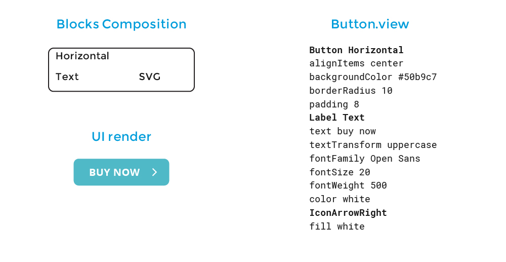
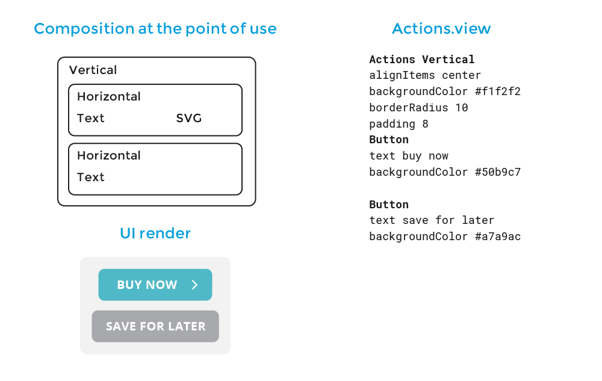
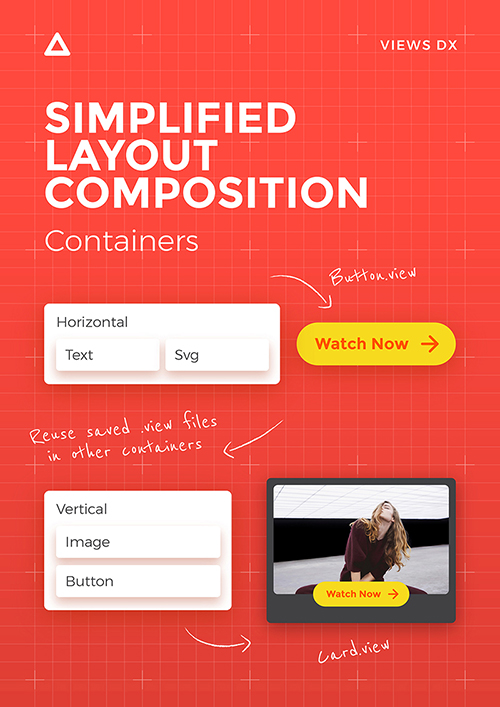
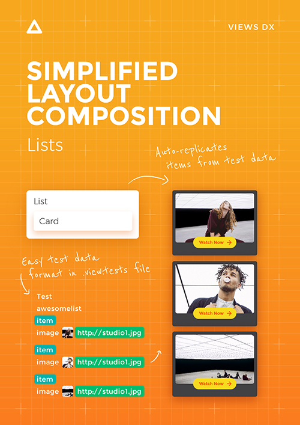
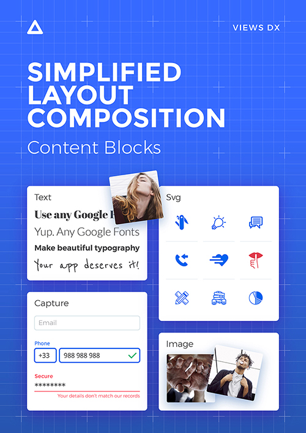

# Views
**An effective framework for creating production quality interfaces**

Views is a simplified language to describe user interfaces (UI) and their interactions (UX).
This is what it looks like:

```
Text
color deepskyblue
text Hello Views!
```

There are no divs, classes or ids. We use blocks to compose interfaces.
Blocks make the composition easy to understand even for non-technical professionals.

Views lets you build web, iOS, Android and Desktop applications from the same codebase by
morphing to React and React Native in JavaScript. It doesn't add a runtime
overhead to your application.

Views language and its morphers are open source.
[You can contribute here](https://github.com/viewsdx/morph).

We're also working on a toolset to enhance the design and development process
even more. It is currently in closed beta and we're expecting to release
the public beta by December 2017. Email us at hi@viewsdx.com and we'll let you
know when its ready. [Here are some teasers in the meantime 😉](https://dribbble.com/shots/3849292-Views-DX-Editor-with-Composer/attachments/872202).

## 👋 How can you benefit from it?
_Views makes teams productive._ Designers contribute directly to the production build.</br>
_Views improves build quality._ Designers can tweak styling without wasting dev time.</br>
_Views compiles to React and React Native._ No manual work is required in the compilation process.</br>
_Views comes with a creative toolset._ For designers who prefer tweak over building from scratch.

You can speed up your development.</br>
Perform faster revision loops.</br>
Test innovative ideas.</br>

## 🚀 Who is using it successfully?
- A strategic partner to deliver their core application to their 50 million users in the USA. _Web app_.
- Views toolset. _Electron Desktop app_.
- 2BFIT. _Mobile native app_ [App store](https://itunes.apple.com/us/app/2bfit/id1279427455?mt=8&ign-mpt=uo%3D4) [Play store](https://play.google.com/store/apps/details?id=com.viewsdx.app2bfit&hl=en)
- Classuite. _Mobile native app_.

## Using Views in your project
Views morphs to the web and desktop through React DOM and to iOS and Android through React Native.
Views can support other morphing targets, if you're interested in implementing
on Angular, Ember, Vue, etc, [let us know](https://github.com/viewsdx/morph/issues/new)!

1. If you don't have an app, create a new one:
_To make a new web or desktop app_ run:
```
yarn global add create-react-app
create-react-app my-app
```

_To make a new native app_ run:
```
yarn global add create-react-native-app
create-react-native-app my-app
```

2. Add Views on it:

```
cd my-app
use-views
```

# Composition model

Views uses [Atomic Design Composition Pattern](http://patternlab.io/) to ensure
interface consistency across all views.


Views composition model is a collection of embeddable blocks.



Every `.view` file is a self contained component with a top level container block and content blocks.
As a component it can be used inside of any other `.view` file and styled at point of use.



The power of the atomised composition model allows components to become reusable templates as the
app's functionality and the design system grows.

Views is perfect for building application's interfaces.




## Properties
Props are all that matters in Views!

They define the style and type of all States, Blocks and Views.

There are two kinds of properties:
- _Internal_: value is defined in the same .view file.
Example: `text Buy Now`, `color red`
- _External_: value comes from somewhere else (.view.tests file, service, back-end).
Example: `text props.buttonLabel`

Say, you want to change the Button's Label dynamically depending on the View
where the button is being used in?
1. Replace the value you want to make dynamic with `props.anyName`
2. Pass the value in Tests and point of use like `anyName some value`

Here's an example of replacing `text` from `Button Label` to a dynamic value
received through `props.label`.

**before**:
```
Text
text Button Label
fontSize 20
color #f7941e
```

**after**:
```
Text
text props.label
fontSize 20
color #f7941e
```

Let's call that view `Button`. When you use it in another view, you will have to
define the prop `label` like this:
```
Button
label Buy Now!
```

## Blocks

A `Hello World` example in Views may look like:
```views
Text
text Hello World
```

A block is defined by its type. In the example above we use `Text` type to render
text in the view.

Additionally, a block can have a name:
```views
Greeting Text
text Hello World
```
It's a good DX([Designer-Developer Experience](https://learndx.com/)) practice
to name your blocks. It helps you and your team to understand and find the
blocks faster. They are also the way to reference specific view elements for
automated QA testing.

The type is required, if you're using a name, it's always defined after the
name `Name BlockType`.

[Here's, around minute 52, Tom explains how to save blocks as a view and use it in another view in code)](https://youtu.be/S-5rbcnXWtI?t=51m38s).
This process is greatly simplified and more straight forward in the toolset.


### Block Type
In Views, we distinguish three types of blocks: `Containers`, `Content` and
`Custom blocks`.


*Container* blocks let you group blocks together. They are:
* `Vertical`
* `Horizontal`
* `List`

`Vertical` and `Horizontal` let you lay blocks out. `Vertical` will stack any
blocks inside of it one below the other and `Horizontal` will get them side by
side.

Views uses flexbox to lay out your blocks in the UI. It's a layout mode intended
to accommodate different screen sizes and different display devices without much effort.
[If you're curious about you can read more about flexbox here](https://developer.mozilla.org/en-US/docs/Web/CSS/CSS_Flexible_Box_Layout/Using_CSS_flexible_boxes).

In CSS terms, `Vertical` is a shortcut for `flex-direction: row`.

If you've been doing Web development for a while, you might be wondering why
we chose it over the default block mode of that CSS has. The main reasons are
that it's more predictable, meaning it's easier to use for newcomers than
`display: block`, and also that it works across platforms in native apps thanks
to Facebook's [Yoga layout engine](https://github.com/facebook/yoga).

By the way, that doesn't mean that you can't use other `display` values. See
the [quirks](QUIRKS.md) for a few cases in which we've spotted flex wasn't
cutting it for us.

`Vertical` and `Horizontal` are also actionable blocks, which is a fancy way to
say that they can take click or press events. *That's how you make buttons in
Views*, for example:

```
Button Vertical
onClick props.doSomeAction
Text
text click me
```


`List` lets you repeat one item many times.
It needs one prop, called `from` which tells where the list gets its data from.
A `List` can only take one block inside of it, so if you want more complex things,
like a card, you will want to use a container block like a `Vertical` or a `Horizontal`.

Inside a `List` you get access to an `item` and `index`. `item` has whatever your
list has and `index` tells the position of the item in the list starting at 0.

```views
List
from props.people
Text
text item.name
```

You can style a `List` as you would with any other container. By default it
stacks its elements like `Vertical` does. If you want it to stack them
horizontally, add the prop `flexDirection row` to it.



*Content* blocks let you, well, show stuff. You met one before, `Text`, let's
meet all of them:
* `Text`
* `Image`
* `Svg`
* `Capture`

`Text` is probably the block you'll use the most. Its most important prop is,
wait for it... Are you ready?!? 👉 `text`. 😱. Yeah, I know, you saw that one
coming... Sure.
A `Text` block can take almost any CSS, more importantly it takes font styles,
like `fontFamily`, `fontSize`, `fontWeight`, `lineHeight`, `letterSpacing`,
etc. And colours. Oh yeah, `deepskyblue` and `deeppink`. Now we're talking.
For the Irish, British and Australians in the world, remember that the prop is
`color` and not `colour`. 🤐.



We all know everyone loves web fonts. You can use those here too. Yeah, Google
fonts, Typekit, even that piece of art you have sitting in that custom woff file
in your computer would work. However, if you're using web fonts, please please
please, use `fontWeight` too. You see, we're doing some smart stuff there to
ease font loading and you're better off being specific so we don't have to load
stuff unnecessarily and make your app slower. Remember that the more fonts you
use, the more it will take for your app to load, so use them with caution. 🤓.

Here's an example of how to use it:
```views
Text
fontFamily Roboto
fontWeight 300
text nananana nananana nananana Batmannnn!!!!!!! 🍀
```

If you're using a Google Font, Views will automatically specify the right
fallback (`sans-serif`, `serif`, etc) on web for you.

There's a bit of legwork to get your fonts working in your app for now. For
React Native see [this](https://docs.expo.io/versions/latest/sdk/font.html#content). For React DOM,
use a `<link>` tag in your HTML like Google Fonts suggests or an `@import(...)`
statement in `index.css`. We will automate this in Views at some stage.

`Image` takes a `source` prop, it can be a URL or a local file. TODO

`Capture` TODO
`CaptureEmail`
`CaptureFile`
`CaptureInput`
`CaptureNumber`
`CapturePhone`
`CaptureSecure`
`CaptureText`


_SVGs are amazing_. They let you do amazing graphics that scale like crazy.
Of course you can use an `Image` block to just show an SVG file as an image
but if you want to do more crazy stuff with them, like animating parts of it
or changing how it looks like on the fly, you're better off using an `Svg`
block. Inside it, you can use a these specific blocks:

* `SvgCircle`
* `SvgEllipse`
* `SvgGroup`
* `SvgLinearGradient`
* `SvgRadialGradient`
* `SvgLine`
* `SvgPath`
* `SvgPolygon`
* `SvgPolyline`
* `SvgRect`
* `SvgSymbol`
* `SvgText`
* `SvgUse`
* `SvgDefs`
* `SvgStop`

While you can make an `Svg` by hand, like:
```
Svg
viewBox 0 0 20 20
width 20
height 20
SvgCircle
cx 10
cy 10
r 5
stroke deepskyblue
```

It's certainly more fun that have that done automatically for you 😇. You can
run `views-morph file.svg` and 💥! You'll get a ready to go Views Svg!

[Here's a little video on how you can use it in your project today](https://learn.viewsdx.com/from-svg-to-view-in-1-2-3-79cf8d771485).

### Proximity nesting
Proximity nesting is how we do composition inside a view. You can think about your
view as a stack of blocks where new lines set blocks apart.

```
Top Vertical
InsideTop Vertical
Text
```
In the example above, the hierarchy is:
* `Top`
  * `InsideTop`
    * `Text`

What if we want to have the text at the same level of `InsideTop`? Our code
would look like:

```
Top Vertical
InsideTop Vertical

Text
```

Our hierarchy now looks like:
* `Top`
  * `InsideTop`
  * `Text`
That new line before `Text` separates it from `InsideTop`.

This is a rule that applies to almost all blocks except the following content
blocks: `Image`, `Text`, `CaptureEmail`, `CaptureFile`, `CaptureNumber`, `CapturePhone`,
`CaptureSecure`, `CaptureText`, `CaptureTextArea`, `Proxy`, `SvgCircle`, `SvgEllipse`, `SvgLine`,
`SvgPath`, `SvgPolygon`, `SvgPolyline`, `SvgRect`, `SvgText`, `SvgStop`.

With that in mind, if we want to have two `Text`s next to each other, we don't
need a new line between them. The following code:
```
Top Vertical
Text
Text
```

Gives us the hierarchy we're after:
* `Top`
  * `Text`
  * `Text`

A view can only have one top level block. If you have more than one, only the
first one will be displayed. E.g.:

```
Top Vertical
Text

Text
```
In the example above, the second `Text` is outside of the top level container
therefore it won't be displayed.

## States

Blocks and Views can have many states driven by `when` statements.
Example:
```
Text
when props.error
text This is wrong...

Text
when !props.error
text This is OK :)
```

_TODO Implement [improved states through pattern matching](https://www.youtube.com/watch?v=dsaAF7cX5xc)._

## ✨ Tests

### Contract between .view and view.tests files
We all want our UIs to be tested. It's hard to do that though. UIs in particular
change often and it's a bit painful to keep your tests updated at all times.

We want to help make testing easier, so we made it practical. By writing tests you're desigining
your application in its different stages.

We've also started experimenting with automated structural UI testing. [See
automated-ui-testing.js](automated-ui-testing.js) for a reference implementation
in Jest. ensure that any future changes are being consciously
applied and that unwanted regressions are caught in time.

It works like this: say we have a view that shows a list of people:
```views
People List
from props.people
Person Text
text item.name
```

Without passing any data to `item.name` the list won't render in the preview.

Tests allow us to pass temporary data to the View that has external properties defined.
Here's an example of .view.tests file for our List block above:

```views
Main Test
people
item
name Tom
item
name Dario
```


### .view.tests

_TODO Functional examples_

## View
### Easy in, Easy out
There is no view without `.view` file.

Each saved view will be morphed (compiled) to production quality JavaScript and
saved as `.view.js` file.

If on some point you decide you don't need Views anymore you can always use
generated components located in `.view.js` files without rewriting any code.

### Embedding Views
Views can be used in other views through their file name.


Common use case: Say you have a View that contains a button with a text label and
you want to choose different font size for it. You will want to change it in one
place instead of in every place of use.
1. Extract the button code to separate .view file and save it as file
starting with a capital letter
2. Replace the previous button code with only the name of the extracted View,
in our example it's `Filename`
3. From now on `Filename.view` is your Custom Block and you will
see it being updated across your app upon any new changes.

This is a simple View with one Text Block BEFORE using it as a Custom Block:
```views
Text
text Button Label
fontSize 20
color #f7941e
```

And here's how it should look like AFTER turning Text Block into a Custom Block:
```views
Filename
```

Calling Views by the `Filename` requires the `Filename.view` in src
folder with the code you want to inject. In the example above, `Filename.view` should have:

```views
Text
text Button Label
fontSize 20
color #f7941e
```

Custom Blocks are capable of storing Properties, States, and Blocks, and even
another Views or Smart Views.

Since any existing .view file is a Custom Block by default anyone can create, manage,
and delete them. It makes the composition pattern accessible to designers and
non-technical team members.

## .view.logic === Smart View
Any View file can be also wrapped with JavaScript logic to make a Smart View.

With `Counter.view` file like:
```
Text
color black
text props.number
```

We can add a `Counter.view.logic.js` file that would increment a number by one
every second like this:
```
import Counter from './Counter.view.js'
import React from 'react'

export default class CounterLogic extends React.Component {
  state = {
    number: 0,
  }

  componentDidMount() {
    this._interval = setInterval(this.increment, 1000)
  }

  componentWillUnmount() {
    clearInterval(this._interval)
  }

  increment = () => {
    this.setState({
      number: this.state.number + 1
    })
  }

  render() {
    return <Counter number={this.state.number} />
  }
}
```

A logic file is an extension to your view and Views imports that it if it's
available. In other words, if you then use your `Counter` in other views, you
will actually be using the `Counter.view.logic.js` instead.

This is where you would add any intermediate state to your views or connect them
to an external store of data.

## .view.tests.json
TODO 💾

## animations
TODO

## states/better ternaries :)
TODO

## routes and teleports
TODO
```
App Vertical

Home Vertical
at /
Text
text main
Vertical
teleportTo page
Text
text go to page


Page Vertical
at /page
Text
text some page

Vertical
teleportTo ..
Text
text back
```

## Views and your React components
If you want to use an existing React component as is, you can import it by
defining it as a `.js` file and adding a `// @views` pragma at the top.

E.g., say you have a file called `Magic.js`:

```
// @view
import React from 'react'

export default props => props.word
```

You can now use that component as you would use any other view in your system:

```
Magic
word hey!
```

We'll be working on bridging NPM modules at some stage, but for now you can
bridge any external modules by hand. Here's an example with
[react-google-maps](https://tomchentw.github.io/react-google-maps/).

`GoogleMap.js`
```
// @view
import { GoogleMap } from 'react-google-maps'
export default ({ defaultCenterLat: lat, defaultCenterLng: lng, ...props }) => (
  <GoogleMap defaultCenter={{ lat, lng }} {...props}>
    {props.children}
  </GoogleMap>
)
```

`Marker.js`
```
// @view
import { Marker } from 'react-google-maps'
export default ({ positionLat: lat, positionLng: lng, ...props }) => (
  <Marker position={{ lat, lng }} {...props} />
)
```

Then in your view, following [the example from their docs](https://tomchentw.github.io/react-google-maps/#usage--configuration):

```
GoogleMap
defaultZoom 0
defaultCenterLat -34.397
defaultCenterLng 150.644
Marker
positionLat -34.397
positionLng 150.644
when props.isMarkerShown
```

You will notice that we've renamed certain props and flattened them out. In
order to reduce the complexity of the language we made a decision not to allow
complex objects in views as props for now. This isn't set in stone though, so if
you feel strong about it, let us know and we can work to enable a syntax like:
```
GoogleMap
defaultZoom 0
defaultCenter
lat -34.397
lng 150.644
Marker
position
lat -34.397
lng 150.644

when props.isMarkerShown
```

## Syntax highlighting
We’ve created the following packages to help you understand `.view` files better:
* [Atom](http://atom.io/packages/language-views),
* [Sublime](https://github.com/viewsdx/syntax-sublime),
* [VIM](https://github.com/viewsdx/syntax-vim), and
* [VSCode](https://marketplace.visualstudio.com/items?itemName=uxtemple.views).

We currently highlight block names, numbers, props, and strings. Our highlighters
aren’t perfect, but they should get us started. Feel free to submit fixes and suggestions!

If you’re using other editors and come up with a syntax highlighter for it, reach out,
and we’ll add it to this list.

Happy editing!

## I ran views-morph on my project, and it created a bunch of other files, what's going on?
Say you have a View called `My.view`. When morphing it, Views will create a file
called `My.view.js`. If you're morphing to `react-dom`, it will also create a
`My.view.css` that gets automatically imported. You can avoid that external CSS
file altogether by running the morpher like `views-morph My.view --as react-dom
--inlineStyles`. You can safely ignore these files as they'll be created on the
fly when the morpher runs.

## Views is a knowledge transfer platform!
The value of cross-functional teams is very well known to Growth Hacking community
and it's explained well in this book [Hacking Growth: Fastest Growing Companies Breakout](https://www.amazon.com/Hacking-Growth-Fastest-Growing-Companies-Breakout/dp/045149721X)


Views helps build fast experiments that can be expanded to fully featured products
and don't end up thrown away after testing, like it's in a case of prototypes.

Every team that introduced non-technical members using Views on an early stage of
product development noticed massive spikes in productivity, motivation, and cross-domain
knowledge transfer.

_We learn the best from each other and on the job_

Because Views syntax, composition, state and logic concepts are much easier to
grasp than in a typical HTML, CSS, JS stack, non-technical team members have fewer
barriers to start writing code.

_We think that the code we write should be beautiful, meaningful, and simple_

As a collaboration platform Views removes silos and brings down the walls between
development and the rest of the organisation.

_We cherish openness, learning, and frequent shipping_

To learn more and share your thoughts go to our Medium publication [Learn ViewsDX](https://learn.viewsdx.com/) or join our [Slack Community](slack.viewsdx.com)

## 😍 How can I help?
We're thrilled you want to help us make better UIs together 😀.
You can contribute to the docs on [this repo](https://github.com/viewsdx/docs)
and to [Views morphers here](https://github.com/viewsdx/morph).

If you have any questions, you can always find us on:
- Slack https://slack.viewsdx.com,
- Email hi@viewsdx.com, and
- Twitter [@viewsdx](https://twitter.com/viewsdx).


License BSD-3-Clause.<br>
Copyright 2017 by UXtemple Ltd.
