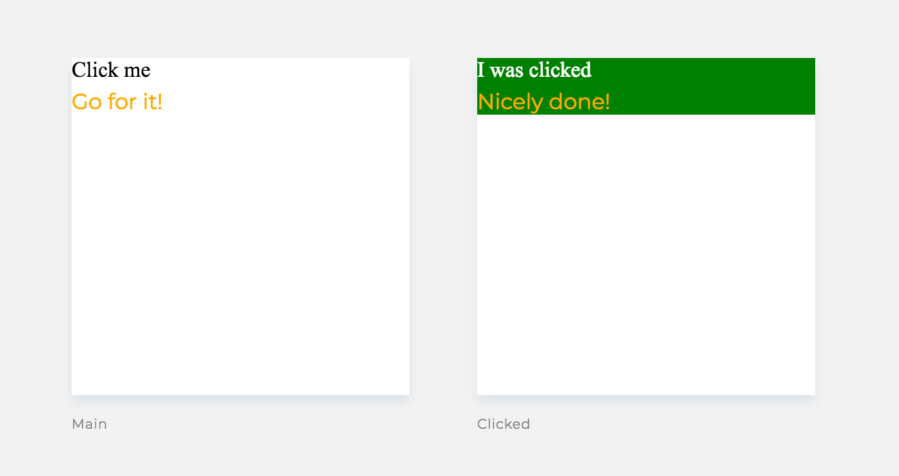

# Scope properties

Setting one or multiple conditions on a block will define the way it will render.
There are two ways you can take advantage of the scopes on any given block:
1. To control how a block looks like when rendered in the view
2. To show or hide a block from the view

Scopes are defined in the logic files, back-end, or via service call.
Each scope depends on the value passed to respective slot.

General syntax rules:
1. `when` the `<conditionName` is true, display
2. `<!props.conditionName` is a negation of the value passed to the slot
3. There is a base scope which includes all the properties of the block without
leading `when` statement.
4. Properties included in each scope have to also be used in the base scope
with a default value.

## Control properties of blocks dynamically
Blocks and Views can have many scopes driven by `when` statements.
Basic example:
```views
Button Vertical
backgroundColor white
onClick <
when <isClicked
backgroundColor green
Label Text
color black
text Click me
when <isClicked
color white
text I was clicked
```
This comes handy when you want to change a block on interaction, or when you
want to animate transitions.

There is a specific structure to a block with `when` properties.

Styling properties positioned directly below the name, and type, of a block become the
base style. They can be changed based on passed slot conditions. From the example above:
`when <isClicked` is a condition added to the Button wrapping the Text block.
Above this `when` condition, and as a part of base style, you can position any
styling properties, we use `backgroundColor white`.

Below the `when` condition you can overwrite the conditions from the base styles.
We change background color of the button to `green` using `backgroundColor green`.

There can be any number of the `when` conditions within the block you need.
After adding properties below each `when`, remember to add it also to the base
style with a default value.

`when` conditions can be triggered on any basic blocks and custom views.
The `when` property doesn't have to be passed down to the custom view manually.
It will apply automatically. So, this is also valid even tho Title view doesn't
have the `when <when` specified anywhere within the view.

```views
Button Vertical
backgroundColor white
onClick <
when props.isClicked
backgroundColor green
Label Text
color black
text Click me
when <isClicked
color white
text I was clicked
SubTitle
marginTop 5
text Go for it!
when <isClicked
text Nicely done!
```
The `SubTitle` view is saved as `SubTitle.view` file and contains on `Text` block
with `text` defined as external slot.
```views
SubTitle Text
marginTop < 10
color #ffaa00
fontFamily Montserrat
fontSize 16
text < my text
```
As you see, there is no `when` props in the `Subtitle` view but the `text` values
are changing based on the `isClicked` condition specified in `Button.view` file.
By default `when` will get `true` value and will create a new artboard in Views Tools.

Here's the visual result of the conditions above :


## Control when blocks are rendered/shown

You can use `onWhen` condition as part of the base scope to act as a rendering
switch, and show or hide the block.

```views
Popup Text
text Yoohoo!
onWhen <goesYoohoo
```
At this point slot `<goesYoohoo` expects a boolean value and can be set
as true or false in the state of the `.view.logic.js` file.

If you use Views Tools you will see two artboards in the preview with Popup block
shown in the first one and not visible in the second, because by default `onWhen`
get's `false` value (or strictly `undefined`).

The Popup will be rendered in the view of the final production build based on the
value of the `<goesYoohoo` passed from the `Popup.view.logic.js` file, from
the back-end, or via an API call. By default the Popup will not render.

## To avoid errors, make sure your fake props comply with these simple rules:

1. Always start the scope name with a `when`
2. The name of the scope can have spaces, but not special characters like dashes or parenthesis.

## Javascript ternaries and props are no longer supported
With the simplification of `when` conditions, ternaries like:
`text props.isClicked ? 'Nicely done!' : 'Go for it!'`
are no longer supported.

With the introduction of slots, props are no longer supported (specifically from
the morpher version 12.0.0)


Reach out with questions via our [Slack Questions Channel](https://slack.viewsdx.com/).
Mention `@views-tom` or `@dario` to make sure that we get your notifications.
